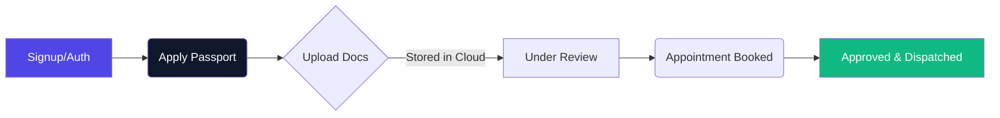

<div align="center">
  
</div>

<div align="center">
  <p align="center">
    <b>A Next-Gen Digital Solution for Passport Services</b>
  </p>
  <p>
    <a href="https://supabase.com/"></a>
    <a href="https://developer.mozilla.org/en-US/docs/Web/JavaScript"></a>
    <a href="https://web.dev/"></a>
  </p>
</div>

<br />

## 📖 About The Project

Traditional passport processes are tedious. **Global Passport Management System (GPMS)** shifts the entire process into the cloud. Designed with an ultra-premium **glassmorphic aesthetic**, this system provides an entirely digital pipeline for document verification, scheduling, and tracking. 

Ideal for final year college submissions, integrating direct cloud databases without monolithic backends.

---

## ⚡ Core Workflow



---

## 🚀 Key Modules & Capabilities

| Module | Description | Highlights |
| :---: | :--- | :--- |
| 🧑‍💻 **Applicant Portal** | Centralized dashboard for users to apply, book and generate receipts. | Dynamic Tracking Timeline, Print PDF. |
| 📂 **Document Engine** | Securely uploads user PAN/Aadhaar documents via Supabase. | Strict MIME-type validations natively. |
| 🛡️ **Admin Console** | Distinct protected portal with real-time analytics & verification capabilities. | Direct approval/rejection algorithms. |

---

<br />

## 🛠️ Stack & Architecture

<table align="center">
  <tr>
    <td align="center" width="96">
      
      <br>HTML5
    </td>
    <td align="center" width="96">
      
      <br>CSS3 (Variables)
    </td>
    <td align="center" width="96">
      
      <br>ES9 JS
    </td>
    <td align="center" width="96">
      
      <br>Supabase PG
    </td>
    <td align="center" width="96">
      
      <br>Vite.js
    </td>
  </tr>
</table>

---

## 💻 Quick Start & Deployment

Run this project perfectly on your local machine to study or demo:

### 1️⃣ Clone & Install
```bash
git clone https://github.com/Jaydip212/Passport-Management-System.git
cd Passport-Management-System
npm install
```

### 2️⃣ Cloud Database Setup
Head to [Supabase](https://supabase.com/), create a new project.
1. Run the entire `supabase_schema.sql` code in the Supabase **SQL Editor**. (Creates tables & RLS).
2. Create a public bucket in Storage titled `documents`.
3. Create a `.env` file referencing `.env.example` and place your URL + Anon Key.

### 3️⃣ Fire it up! 🔥
```bash
npm run dev
```

Your system is now exclusively running on `localhost:5173`. 
*(Hint: Create an account and override the `role` directly in Supabase to `admin` to access the backend staff portal).*

<div align="center">
  <br>
  <i>Designed for Distinction 🏅</i>
</div>
